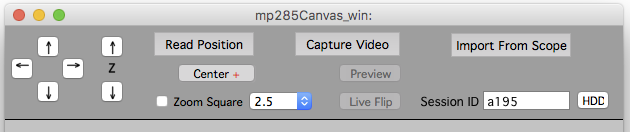

# Canvas

Canvas is software to acquire and visualize spatially organized video and image volumes acquired with a scanning microscope.

This is most useful when performing repeated time-lapse imaging as it allows disjoint images to be acquired and then easily and rapidly returned to on subsequent imaging sessions across timescale of minutes, days, and months.

### Features

 - Create a Canvas that visually places each video image and scanned images into a unified ‘motor space’.
 - Previous canvases can be loaded and displayed using the Map Manager Stack Browser.
 - Quickly and easily acquire the same fields-of-view both within and between time-points spanning minutes, hours, days and months.


## Gallery


**Example 1.** Screen shot of a canvas during an in vivo experiment. Gray images are a mosaic of video images of surface vasculature visualized through a cranial window. Green images are maximal intensity z-projections of in vivo two photon volumes (6 in total). All images are linked, clicking on one will bring up the full image volume. 


**Example 2.** The gray images are an automatically created mosaic of surface vasculature images from a video camera looking down into a cranial window. The green squares are the position of image stacks acquired with a scanning microscope. The Canvas software seamlessly integrates with [Map Manager][map manager] providing point and click navigation, browsing, and annotations of all image stacks.


<div class="print-page-break"></div>

**Example 3.** This is an example of a Canvas acquired during two-photon imaging and electrophysiology in a cerebellar slice. The first image is an overview of the canvas and the second is a zoomed in view of the recording and imaging areas.

## Hardware and Software Requirements

 - Windows 7 or Windows XP
 - Wavemetrics Igor Pro 6 or 7, [link][wavemetrics]
 - Motor controllers (to get/set the position of the objective
    - Sutter Instruments mp285, [link][mp285]
    - Bruker Prairie view software 
 - Scanning microscope software (to import images)
    - ScanImage, [link][scanimage]
    - Prairie View
 - Video acquisition
    - Any USB video camera


## Canvas Panel

**X/Y/Z**. Gives the current position of the motor.

**Read Position**. Reads the current motor position.

**Zero X/Y** and **Zero Z**. Zero the current position in the Canvas software. This does not move the onjective but is useful to be able to read absolute distances moved.

**Arrow Buttons**. Move the motor the specified distance. All units are in um. The four arrows in the left pane move within the image plane (left, right, front, back). The two arrows in the right plane move in depth/z (up and down).

**X, Y, and Z Step (um)**. Set the distance (in um) taken when each of the arrow buttons are used to move the motor.

**Set Path**. Set the save path of the current canvas. This can automatically be set in a scripted user file.

**Initialize Session**. Initialize a new session with specified ‘Session ID’. Each new session will have its own canvas and save folder.

**HDD**. Show the hard-disk-drive folder for the current session.

**Display Canvas**. Display the current canvas. The current canvas is created when a session is initialized with ‘Initialize Session’.

**Finalize and clear canvas**. Used at the end of an imaging session to close the current canvas.

<div class="print-page-break"></div>

## Canvas Motor Controls



<div class="print-page-break"></div>


## Options Panel

### Video Group.

Specifies the size of a video image in both pixels and um.

### Refresh 2P Squares Group.

**Display This Channel**. The default color channel to display in the canvas.

**Auto Save Canvas and Notebook**. The canvas and notebook will be saved each time ‘Import From scope’ button is pressed.

### Serial Port (mp285) group.

Options to control the serial port for communication with a Sutter MP285 motor controller.

### TCP/IP (bruker) group

Options to control communication with the Bruker Prairie view software.

### Objective Group.

Each row is a different objective with:

 - Name. Name of the objective. Usually 20x, 40x, 5x, etc.
 - Width. Width of field of view of objective (um)
 - Height. Height of field of view of objective (um)
 - Stepx and Stepy. Distance the motor will move when a movement arrow button is pressed. These values also appear in the canvas motor bar.
 - voxelsize. For importing .tif files. This is the x/y voxel size (um) of a stack taken at 1x magnification and 1024 ‘pixels per line’, 1024 ‘lines per frame’. This value is used to linearly scale all other stack imports to arbitrary magnification and ‘lines per frame’/’pixels per line’.


## Acquiring video

If the video camera on your scope has an analog signal, there are very inexpensive video to usb converters. We regularly use EasyCap DC60 converters ($10-$20). Converters like this take an analog video signal, convert it to USB and then single frames or video is captured within Igor Pro using their free driver.

High end USB2/3 cameras will generally work but the size of the frame acquired by Igor may be smaller than the sensor. To circumvent this, we have a video viewer/capture script written in Matlab that saves full FOV images from a usb camera that is then automatically loaded into Igor.

## Controlling the objective

The position of the objective is read and the objective can be moved from within the canvas.

### Sutter mp285

Both ScanImage and Igor need to read the position and move the motorized objective. This is done by communicating with one physical serial-port, a COM port. Microsoft Windows only allows one program to communicate with each physical serial-port but we need both Matlab and Igor to communicate with the same COM port. Thus, we use third-party software to split the physical COM port into two virtual ports, one for Matlab and one for Igor.

There are a few different programs to create virtual COM ports from one physical COM port.

 - Windows 7: Serial Splitter 5.0 (Eltima Software), $100. As of Aug 2014 this is what we are using and it is working well.
 - Windows 7: Serial Port Splitter from www.fabulatech.com
 - Windows XP : Etima Software has a 32bit version, FREE
 - com0com,  an open source project. If anyone gets this working, please let us know. FREE

### Prairie View

The Canvas software communicates with Prairie View over a TCP/IP (localhost) connection using Igor's SOCKIT library.


## Installation

Canvas is designed to work on any scope that has a computer controlled objective or stage. It has been tested using x/y/z objective motors using a Sutter mp285 controller and a Bruker Scope using Prairie View software.

### mp285 motor controller

 - Install [Serial Splitter 5][serialsplitter]
 - Make 2 virtual serial ports from the COM port the mp285 is plugged into
 - Rewrite ScanImage startup script to use one of the virtual COM ports
 - Make sure Igor is using the other virtual COM port
	
### Bruker motor controller

For Bruker Prairie View, we need the Igor SOCKIT extension.
	- Download [SOCKIT][sockit]
	- Uncompress and install SOCKIT XOP into Igor Pro 6
	- Once this is done, motor position will be read and motor will be moved using a localhost TCP/IP protocol

## Running canvas

 - Open Igor 6
 - Open PrairieCanvas.ipf
 - Compile procedures by clicking on the Igor command window
 - Select menu 'Canvas - Load User' and select a user .txt file. This will open the main canvas panel.
 
 - Create a new canvas by entering a 'session ID' and pressing 'Initialize Session'. This will open a new canvas window with motor controls.   

 - Show a preview of the USB video camera with the 'Preview' button.
 - The red square in the canvas shows the current motor position.
 - Move the motor with arrow buttons. The red square should update its positon. IF it does not, try the movement again.
 - Capture video with 'Capture Video' and the video will be placed in the current position within the canvas.
 
 - Scan some images in either Scan Image or Prairie View and then hit 'Import From Scope' to import these images into the canvas. The images will appear as squares in the canvas. Selecting a square will highlight the stack in the Stack Browser and the stack can be opened directly into Igor.
 
The canvas is automatically saved as new video and scope images are created and imported.

## Off line analysis

 - Run Map Manager and open the Stack Browser
 - Select 'Load Canvas' and load your canvas. The canvas file will be in a session folder and will always start with 'c'.
  
## Default User File

```
#mp285 configuration file
#Robert Cudmore
#create Dec 31, 2013


#prairie specific
root:MapManager3:options:mp285:prairiePath="f:\cudmore\data"

#mp285 specific
root:MapManager3:options:mp285:gSavePath="f:cudmore:data:"
root:MapManager3:options:mp285:gUserSerialMotor=0
root:MapManager3:options:mp285:gFlipVideoHorizontal=0
root:MapManager3:options:mp285:prairieSleepTime_ms=200
#root:bObjective:gSelObjStr="p20x"


#session db path
root:MapManager3:options:stackdb:gSessionDir="f:cudmore:data:"

root:bStack:gYearAndMonthFolders=0

#canvas
#allow video selections
root:Canvas:gAllowVideoSel = 0

#in canvas each stack square gets a number (if == 0 then # is object index in the canvas)
root:Canvas:gScanImageIndexForName = 1

#display motor control bar by default
root:Canvas:gShowMotorByDefault = 1

#right click a canvas and select 'set window width'
root:Canvas:gWindowWidth = 474.75

#right click a stack and select 'set window size'
root:Scale:width = 767.5

#20170403 need to fix this
root:bObjective:gSelObjStr="p20x2"

#20171116, this specidies video sensor pixels (not 2p pixels)
root:MapManager3:options:mp285:pixelsPerLine=1920
root:MapManager3:options:mp285:linesPerFrame=1200

root:MapManager3:options:mp285:gCaptureVideoFromMatlab=1
root:MapManager3:options:mp285:gRaspberryIP="http://10.16.81.61:5010"
```

## Known Bugs

 - If you enter a space in your scanimage file name, your mp285 canvas will not work properly. If you realize this after you have already created a canvas with ‘Import Scanimage’, manually change the space in each scan image .tif file (on the hard-drive) to an underscore (_). Do NOT simply delete the space, you must change it to an underscore.

## Links

 - [Robert Cudmore's homepage](http://robertcudmore.org)
 - [Map Manager][map manager]
 
[map manager]: http://blog.cudmore.io/mapmanager
[wavemetrics]: www.wavemetrics.com
[mp285]: https://www.sutter.com/MICROMANIPULATION/mp285.html
[scanimage]: http://scanimage.vidriotechnologies.com/display/SIH/ScanImage+Home
[sockit]: http://www.igorexchange.com/project/SOCKIT
[serialsplitter]: https://www.eltima.com/products/serialsplitter/